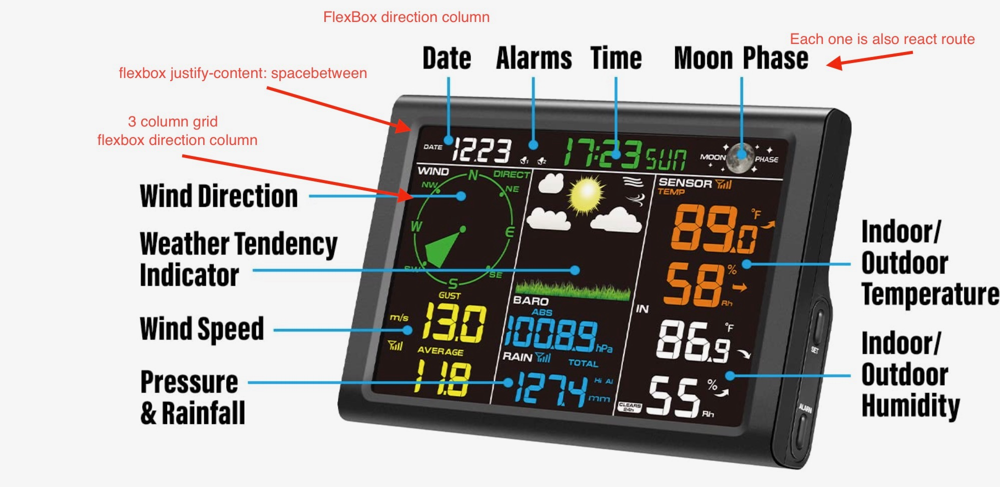

# The Weather App

## This is mostly a dashboard app

### It should look like this


### Requirements
> Application needs an OpenWeatgerMap API Key
> Application also assumes a Samsung SmartThings API key and devices exist
> Data will be pulled from a SmartThings device for indoor data

### How-to start the application
``` sh 
npm run dev
```